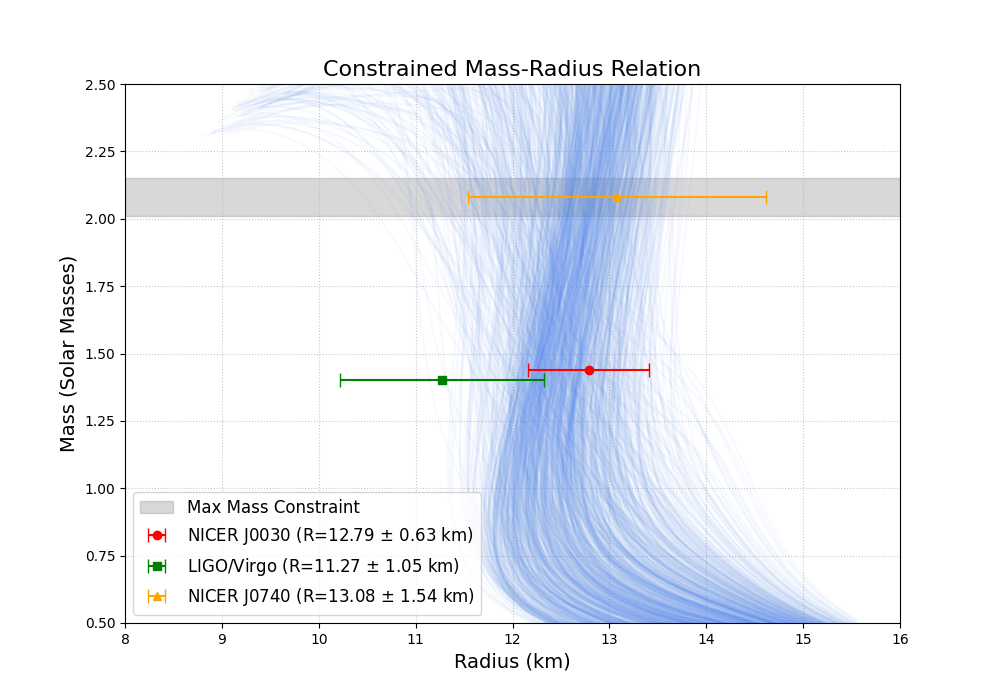
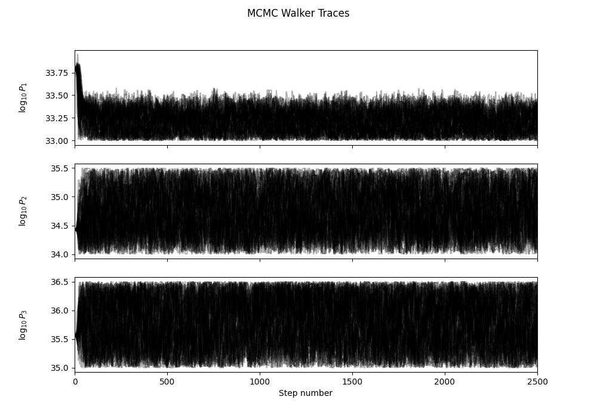

# Bayesian Inference of the Neutron Star Equation of State

This project constrains the neutron star (NS) Equation of State (EoS) by performing a Bayesian MCMC analysis on a 3-parameter piecewise polytropic EoS model.

The "judge" or likelihood function is rigorously constrained by three key multi-messenger astronomical observations:
1.  **LIGO/Virgo:** The gravitational wave event GW170817 (using the EoS-insensitive radius posteriors).
2.  **NICER (PSR J0030+0451):** The mass-radius posteriors for the 1.44 M solar mass pulsar.
3.  **NICER (PSR J0740+0620):** The mass-radius posteriors for the high-mass ~2.08 M solar mass pulsar. 

For the full theoretical background and derivations, see [PHYSICS.md](./PHYSICS.md).


---

## Results

The MCMC simulation, run with 50 walkers for 2,500 steps, successfully found the family of EoS models that are consistent with all three data sets.

### 1. Constrained Mass-Radius Relation

The final "credible band" shows the family of EoS models that are statistically favored. The plot visualizes the core tension in modern astrophysics: the EoS must be "soft" enough to be consistent with the LIGO/Virgo data (green) while simultaneously being "stiff" enough to support the existence of massive pulsars like J0740 (orange) and the general 2.01 M solar mass limit (grey).



### 2. Parameter Posterior Distributions

The corner plot shows the final probability distributions for the three EoS parameters (the log-pressure at 1.85, 3.7, and 7.4 times nuclear saturation density). This shows the specific values and correlations that a physical EoS must have to be consistent with observations.


### 3. MCMC Convergence

The walker traces show that the MCMC successfully converged on a stable solution after an initial burn-in period.



---

## How to Run This Project

This project is structured into three main Python files that work together. The correct sequence to reproduce the results is:

1.  `tov_model.py`: **This is the core physics engine.** It contains all the functions for building the EoS, solving the TOV equations, and the likelihood "judge." It is imported as a module by the other scripts.

2.  `run_mcmc.py`: **This is the main computation script.** It imports the engine from `tov_model.py` and runs the MCMC simulation using `emcee` and `multiprocessing`. This is the script that takes several hours.

3.  `plot_results.py`: **This is the analysis script.** After the MCMC is done, you run this script. It imports the *same* physics functions from `tov_model.py` and loads the results from the MCMC run (`mcmc_results.h5`) to generate all the final plots.

### Step-by-Step Instructions

#### 1. Setup
Make sure you have all the necessary files in the same directory:
* `tov_model.py`
* `run_mcmc.py`
* `plot_results.py`
* `EoS-insensitive_posterior_samples.dat`
* `J0030_data.dat`
* `J0740_data.dat`

#### 2. Depedencies
And install the required libraries:
```bash
pip install numpy scipy matplotlib emcee corner h5py
```

#### 3. Run the TOV engine
Run the [tov_model.py](tov_model.py) file. 
```bash
python tov_model.py
```

#### 4. Run the MCMC Simulation
Execute the [run_mcmc.py](run_mcmc.py) script from your terminal. This will use all available CPU cores to run the simulation.

```bash
# To run the full, 2500-step (500 burn + 2000 steps) simulation:
python run_mcmc.py --n-burn 500 --n-steps 2000
```
This will run for several hours and create a new file: mcmc_results.h5.

#### 5. Generate the Plots
Once mcmc_results.h5 exists, run the plotting script:

```bash
python plot_results.py
```

This script will load mcmc_results.h5, generate all three plots (Trace, Corner, and M-R Band), and save them as .png files in your folder.

---

## Reproducibility

All data files and posterior samples used in this project are publicly available:

1. LIGO/Virgo GW170817 posteriors (Abbott et al., 2018)

2. NICER PSR J0030+0451 (Miller et al., 2019)

3. NICER PSR J0740+0620 (Riley et al., 2021)

The entire pipeline can be reproduced on any system with Python ≥ 3.8.

---

## References

- **LIGO/Virgo:** Abbott et al. (2018), *Phys. Rev. Lett.*, 121, 161101.  
- **NICER (J0030):** Miller et al. (2019), Riley et al. (2019), *ApJ Letters*, 887.  
- **NICER (J0740):** Miller et al. (2021), Riley et al. (2021), *ApJ Letters*, 918.

---
